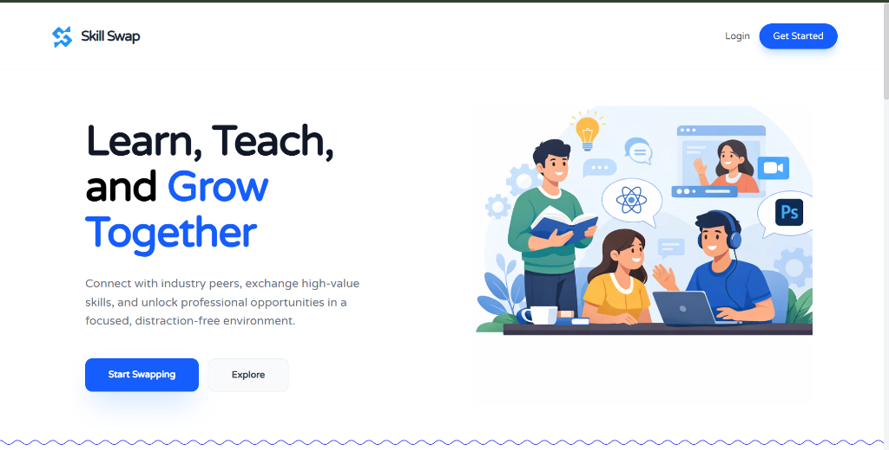
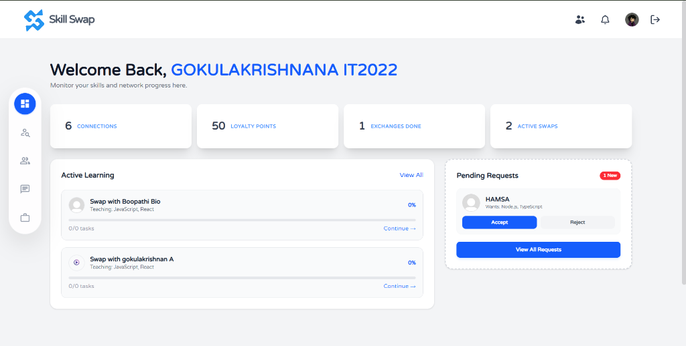

<p align="center">
  
</p>

<h1 align="center">SkillSwap</h1>

<p align="center">
  <strong>A Peer-to-Peer Skill Exchange Platform</strong><br/>
  <em>Teach what you know. Learn what you need. Grow together.</em>
</p>

<p align="center">
  
  
  
  
  
  
  
  
</p>

<p align="center">
  <a href="#-quick-start">Quick Start</a> •
  <a href="#-features">Features</a> •
  <a href="#-architecture">Architecture</a> •
  <a href="#-tech-stack">Tech Stack</a> •
  <a href="#-api-reference">API Reference</a> •
  <a href="#-contributing">Contributing</a>
</p>

---

## 📸 Preview

### Landing Page



> The public-facing landing page introduces SkillSwap's core value proposition — **"Learn, Teach, and Grow Together"** — with clear calls to action for new and returning users.

### User Dashboard



> The authenticated dashboard provides a centralized command center displaying **connections, loyalty points, exchange progress, active swaps**, and **pending requests** — all in a single, intuitive interface.

---

## 📖 Overview

**SkillSwap** is a production-grade, full-stack web application that enables professionals and learners to exchange skills through a structured, peer-to-peer learning model. Unlike traditional learning platforms that rely on paid courses or unstructured forums, SkillSwap creates **direct, meaningful connections** between people who can teach and learn from each other.

### The Problem

| Traditional Platforms | SkillSwap |
|:---------------------|:----------|
| Paid courses & subscriptions | **Free** peer-to-peer exchange |
| One-directional learning | **Bidirectional** skill barter |
| Distracting social feeds | **Focused**, distraction-free interactions |
| No quality control | **Admin-verified** job postings |
| Text-only communication | Integrated **Chat + Audio + Video** |

### Core Philosophy

```
You know JavaScript → Someone needs JavaScript
Someone knows UI/UX  → You need UI/UX

SkillSwap connects you. Both learn. Both grow.
```

---

## 🚀 Quick Start

### Prerequisites

| Tool | Version | Purpose |
|------|---------|---------|
| Node.js | ≥ 18.x | Runtime environment |
| MongoDB | ≥ 7.x | Database |
| npm / bun | Latest | Package manager |

### Installation

```bash
# 1. Clone the repository
git clone https://github.com/your-username/skillswap.git
cd skillswap

# 2. Install backend dependencies
cd backend
npm install

# 3. Install frontend dependencies
cd ../frontend
npm install
```

### Environment Configuration

**Backend** (`backend/.env`)

```env
PORT=8608
MONGODB_URI=your_mongodb_connection_string
JWT_SECRET=your_jwt_secret
SESSION_SECRET=your_session_secret
FRONTEND_URL=http://localhost:3000
NODE_ENV=development

# Google OAuth
GOOGLE_CLIENT_ID=your_google_client_id
GOOGLE_CLIENT_SECRET=your_google_client_secret
```

**Frontend** (`frontend/.env`)

```env
NEXT_PUBLIC_API_URL=http://localhost:8608
NEXT_PUBLIC_CLOUDINARY_CLOUD_NAME=your_cloud_name
```

### Running the Application

```bash
# Terminal 1 — Start the backend server
cd backend
npm start
# → Server running on port 8608

# Terminal 2 — Start the frontend dev server
cd frontend
npm run dev
# → Application available at http://localhost:3000
```

---

## ✨ Features

### 🔐 Authentication & Security

| Capability | Implementation |
|:-----------|:---------------|
| Email/Password Auth | bcrypt hashing + JWT tokens |
| Social Login | Google OAuth 2.0 via Passport.js |
| Session Management | Secure HTTP-only cookies |
| Route Protection | JWT middleware on all private endpoints |
| Role-Based Access | Separate User & Admin permission layers |
| Input Validation | Zod schema validation on all inputs |

---

### 👤 User Profile & Skill Management

- Create and customize user profiles with **Cloudinary-hosted** profile pictures
- Define **skills** (what you can teach) and **interests** (what you want to learn)
- Browse other users' profiles with detailed skill breakdowns
- Search and filter users by specific skills or interests

---

### 🤝 Intelligent Skill Matching

The matching engine connects users based on complementary skill sets:

```
Match Condition:
  UserA.skills  ∩  UserB.interests  ≠  ∅
  UserB.skills  ∩  UserA.interests  ≠  ∅
```

- Automatic discovery of relevant learning partners
- Filtered suggestions based on mutual skill alignment
- Quick-connect workflow from discovery to connection

---

### 📩 Connection & Request System

```
Discovery → Send Request → Accept/Reject → Connected → Exchange
```

- Send connection requests to matched users
- Accept or reject incoming requests with one click
- Maintain a curated network of skill partners
- Track connection metrics on the Dashboard

---

### 💬 Real-Time Chat

| Feature | Details |
|:--------|:--------|
| Protocol | WebSocket via Socket.IO |
| Type | One-to-one private messaging |
| Persistence | Full chat history stored in MongoDB |
| Delivery | Instant message delivery with live indicators |

---

### 📹 Audio & Video Calling

| Feature | Details |
|:--------|:--------|
| Technology | WebRTC (simple-peer) |
| Signaling | Socket.IO signaling server |
| Connection | Peer-to-peer (low latency) |
| Capabilities | Audio calls, video calls, screen presence |

Enables **face-to-face learning sessions** directly within the browser — no external tools required.

---

### 🔄 Skill Exchange Tracking

- **Session-based** exchange model with defined tasks
- Both parties track and confirm progress independently
- **Percentage-based completion** tracking per exchange
- Mutual confirmation prevents one-sided learning
- Loyalty points awarded upon successful completion

---

### 💼 Job & Internship Module

- Browse verified job and internship opportunities
- Post opportunities with title, description, and external links
- **Admin approval workflow** — only verified listings are published
- Quality-controlled career discovery within the platform

---

### 🛡️ Admin Panel

| Capability | Description |
|:-----------|:------------|
| Job Moderation | Review, approve, or reject job postings |
| Content Control | Manage visibility of published listings |
| Platform Monitoring | Overview of platform activity and user metrics |
| Quality Assurance | Ensure authenticity of all posted content |

---

### 🔔 Real-Time Notifications

- Live notification system powered by Socket.IO
- Instant alerts for new connection requests, messages, and exchange updates
- Persistent notification state via Redux

---

## 🏗️ Architecture

### System Overview

```
┌──────────────────────────────────────────────────────────┐
│                    CLIENT — Next.js 16                    │
│                                                          │
│   ┌─────────────┐  ┌─────────────┐  ┌────────────────┐  │
│   │  App Router  │  │   Redux     │  │  Socket.IO     │  │
│   │  (Pages +   │  │   Toolkit   │  │  Client +      │  │
│   │   Layouts)  │  │  + Persist  │  │  WebRTC Peer   │  │
│   └──────┬──────┘  └──────┬──────┘  └───────┬────────┘  │
│          └────────────────┼─────────────────┘            │
└───────────────────────────┼──────────────────────────────┘
                            │
              REST API + WebSocket Connections
                            │
┌───────────────────────────┼──────────────────────────────┐
│                    SERVER — Express 5                     │
│                                                          │
│   ┌─────────────┐  ┌─────────────┐  ┌────────────────┐  │
│   │ Controllers  │  │ Middleware  │  │  Socket.IO     │  │
│   │ (8 modules) │  │ (JWT+OAuth) │  │  Server        │  │
│   └──────┬──────┘  └──────┬──────┘  └───────┬────────┘  │
│          └────────────────┼─────────────────┘            │
└───────────────────────────┼──────────────────────────────┘
                            │
                     Mongoose ODM
                            │
┌───────────────────────────┼──────────────────────────────┐
│                    DATABASE — MongoDB                     │
│                                                          │
│   Users  ·  Messages  ·  Requests  ·  Exchanges  ·  Jobs│
└──────────────────────────────────────────────────────────┘
```

### Data Models

| Model | Purpose | Key Fields |
|:------|:--------|:-----------|
| `User` | User accounts & profiles | name, email, skills, interests, role |
| `Message` | Chat message storage | sender, receiver, content, timestamp |
| `Request` | Connection requests | from, to, status (pending/accepted/rejected) |
| `Exchange` | Skill exchange sessions | participants, tasks, progress, status |
| `JobPost` | Job/internship listings | title, description, link, approval status |

---

## 🛠️ Tech Stack

### Frontend

| Package | Version | Purpose |
|:--------|:--------|:--------|
| `next` | 16.2.1 | React framework with App Router & SSR |
| `react` | 19.2.4 | UI component library |
| `@reduxjs/toolkit` | 2.11.x | State management |
| `redux-persist` | 6.x | Persistent state across sessions |
| `react-hook-form` | 7.72.x | Performant form handling |
| `zod` | 4.3.x | Schema-based form validation |
| `framer-motion` | 12.38.x | Animations & transitions |
| `socket.io-client` | 4.8.x | Real-time WebSocket client |
| `simple-peer` | 9.11.x | WebRTC peer-to-peer connections |
| `next-cloudinary` | 6.17.x | Image upload & CDN delivery |
| `lucide-react` | 1.7.x | Icon library |
| `react-hot-toast` | 2.6.x | Toast notification system |
| `tailwindcss` | 4.2.x | Utility-first CSS framework |

### Backend

| Package | Version | Purpose |
|:--------|:--------|:--------|
| `express` | 5.2.x | HTTP server framework |
| `mongoose` | 9.4.x | MongoDB object modeling |
| `jsonwebtoken` | 9.x | JWT token generation & verification |
| `passport` | 0.7.x | Authentication middleware |
| `passport-google-oauth20` | 2.x | Google OAuth 2.0 strategy |
| `socket.io` | 4.8.x | Real-time WebSocket server |
| `bcrypt` | 6.x | Password hashing |
| `zod` | 4.3.x | Server-side input validation |
| `cookie-parser` | 1.4.x | Cookie parsing middleware |
| `express-session` | 1.19.x | Session management |
| `cors` | 2.8.x | Cross-origin resource sharing |
| `dotenv` | 17.x | Environment variable management |

---

## 📁 Project Structure

```
skillswap/
│
├── frontend/                          # Next.js 16 Application
│   ├── public/                        # Static assets
│   └── src/
│       ├── app/
│       │   ├── (Public)/              # Guest-accessible routes
│       │   │   ├── page.jsx           #   → Landing page
│       │   │   ├── auth/              #   → Login & Register
│       │   │   └── not-authorized/    #   → 403 page
│       │   ├── (Private)/             # Authenticated routes
│       │   │   ├── dashboard/         #   → User dashboard
│       │   │   ├── chat/              #   → Real-time messaging
│       │   │   ├── connection/        #   → Manage connections
│       │   │   ├── exchange/          #   → Skill exchange sessions
│       │   │   ├── findtalent/        #   → Discover users
│       │   │   ├── request/           #   → Connection requests
│       │   │   ├── jobs/              #   → Job listings
│       │   │   ├── profile/           #   → User profile
│       │   │   └── admin/             #   → Admin panel
│       │   ├── globals.css            # Global styles
│       │   ├── layout.jsx             # Root layout
│       │   └── not-found.js           # 404 page
│       ├── Component/                 # Reusable UI components
│       │   ├── Home/                  #   → Landing page components
│       │   ├── (Private)/             #   → Authenticated components
│       │   └── VideoCallOverlay.jsx   #   → WebRTC call UI
│       ├── Context/                   # React Context providers
│       ├── Data/                      # Static data & constants
│       ├── feature/                   # Redux slices
│       │   ├── loginSlice.js          #   → Auth state
│       │   ├── userSlice.js           #   → User profile state
│       │   ├── socketSlice.js         #   → Socket connection state
│       │   ├── requestSlice.js        #   → Request management
│       │   ├── exchangeSlice.js       #   → Exchange tracking
│       │   ├── jobSlice.js            #   → Job listings state
│       │   └── notifySlice.js         #   → Notification state
│       ├── store/                     # Redux store configuration
│       ├── redux/                     # Redux setup utilities
│       └── lib/                       # Shared utilities
│
├── backend/                           # Express 5 API Server
│   ├── controller/                    # Route handlers
│   │   ├── auth.controller.js         #   → Register, Login, OAuth
│   │   ├── user.controller.js         #   → Profile & skill management
│   │   ├── connection.controller.js   #   → Connection logic
│   │   ├── exchange.controller.js     #   → Exchange session logic
│   │   ├── message.controller.js      #   → Chat message handling
│   │   ├── jobPost.controller.js      #   → Job CRUD operations
│   │   ├── admin.controller.js        #   → Admin operations
│   │   └── live.controller.js         #   → Live session handling
│   ├── models/                        # Mongoose schemas
│   │   ├── user.model.js
│   │   ├── message.model.js
│   │   ├── request.model.js
│   │   ├── exchange.model.js
│   │   └── jobPost.model.js
│   ├── routes/                        # API route definitions
│   │   ├── auth.route.js
│   │   ├── user.route.js
│   │   ├── request.route.js
│   │   ├── exchange.route.js
│   │   ├── message.route.js
│   │   ├── jobPost.route.js
│   │   ├── admin.route.js
│   │   └── live.route.js
│   ├── middleware/                     # Express middleware
│   │   ├── auth.js                    #   → JWT verification
│   │   └── oAuth.js                   #   → Google OAuth strategy
│   ├── service/
│   │   └── Socket.js                  #   → Socket.IO initialization
│   ├── schemas/                       # Zod validation schemas
│   ├── utils/                         # Utility functions
│   ├── db/                            # Database connection
│   └── server.js                      # Application entry point
│
├── screenshots/                       # Application screenshots
│   ├── landing-page.png
│   └── dashboard.png
│
└── README.md                          # This document
```

---

### WebSocket Events

| Event | Direction | Description |
|:------|:----------|:------------|
| `connection` | Client → Server | Establish socket connection |
| `send-message` | Client → Server | Send a chat message |
| `receive-message` | Server → Client | Receive a chat message |
| `call-user` | Client → Server | Initiate audio/video call |
| `incoming-call` | Server → Client | Notify of incoming call |
| `call-accepted` | Client ↔ Server | Call acceptance signal |
| `notification` | Server → Client | Push notification delivery |

---

## 🔄 User Journey

```
┌─────────┐     ┌─────────┐     ┌──────────────┐     ┌────────────┐
│  Guest   │────▶│  Login   │────▶│   Profile    │────▶│  Discover  │
│  Landing │     │  /OAuth  │     │   Setup      │     │  Matches   │
└─────────┘     └─────────┘     └──────────────┘     └─────┬──────┘
                                                            │
                ┌───────────────────────────────────────────┘
                │
                ▼
┌──────────────┐     ┌──────────────┐     ┌──────────────────┐
│    Send      │────▶│   Connected  │────▶│  Skill Exchange  │
│   Request    │     │   (Accepted) │     │  (Chat + Video)  │
└──────────────┘     └──────────────┘     └────────┬─────────┘
                                                   │
                          ┌────────────────────────┘
                          │
                          ▼
               ┌─────────────────────┐     ┌─────────────────┐
               │  Track Progress     │────▶│   Complete &     │
               │  (Tasks + %)       │     │   Earn Points    │
               └─────────────────────┘     └─────────────────┘
```

---

## ⚙️ Technical Implementation

### Authentication Flow

```
Registration:
  Password → bcrypt.hash() → Store in MongoDB

Login:
  Password → bcrypt.compare() → Generate JWT → Set HTTP-only Cookie

OAuth:
  Google Login → Passport.js Strategy → Create/Find User → JWT → Cookie

API Access:
  Request → Extract JWT from Cookie → Verify → Grant Access
```

### Skill Matching Algorithm

```javascript
// Pseudocode
matchedUsers = Users.find({
  skills:    { $in: currentUser.interests },
  interests: { $in: currentUser.skills },
  _id:       { $ne: currentUser._id }
});
```

### Real-Time Communication

```
Chat:
  Client A → socket.emit("send-message") → Server → socket.to(room).emit("receive-message") → Client B

Video Call:
  Client A → socket.emit("call-user", signal) → Server → socket.to(userId).emit("incoming-call", signal)
  Client B → Accept → simple-peer connection established → P2P stream
```

### Job Approval Workflow

```
User Posts Job → Status: "pending"
                      ↓
              Admin Reviews
                 ↓         ↓
            Approve      Reject
                ↓           ↓
         Status: "approved"  Status: "rejected"
                ↓
         Visible to all users
```

---

## 🧪 Challenges & Solutions

| Challenge | Solution | Impact |
|:----------|:---------|:-------|
| Real-time messaging | Socket.IO with room-based architecture | Instant, reliable message delivery |
| Peer-to-peer video | WebRTC via simple-peer + Socket.IO signaling | Low-latency face-to-face sessions |
| State persistence | Redux Persist with local storage | Seamless experience across page reloads |
| Secure authentication | JWT + bcrypt + HTTP-only cookies | Protected against XSS & CSRF attacks |
| Content quality | Admin approval workflow for job posts | Verified, trustworthy listings |
| Scalable architecture | Modular controllers + route separation | Maintainable, extensible codebase |

---

## 🗺️ Roadmap

- [ ] AI-powered skill matching recommendations
- [ ] Mobile application (React Native)
- [ ] Advanced analytics dashboard
- [ ] Multi-language support

---

## 📚 References

| Resource | Link |
|:---------|:-----|
| Next.js Documentation | https://nextjs.org/docs |
| Express.js Guide | https://expressjs.com/en/guide |
| Socket.IO Documentation | https://socket.io/docs |
| WebRTC API | https://developer.mozilla.org/en-US/docs/Web/API/WebRTC_API |
| MongoDB Data Modeling | https://www.mongodb.com/docs/manual/core/data-modeling-introduction |
| JWT Introduction | https://jwt.io/introduction |
| Passport.js Strategies | https://www.passportjs.org/packages |
| Redux Toolkit | https://redux-toolkit.js.org |

---

## 🤝 Contributing

Contributions are welcome! Please follow these steps:

1. **Fork** the repository
2. **Create** a feature branch (`git checkout -b feature/amazing-feature`)
3. **Commit** your changes (`git commit -m "Add amazing feature"`)
4. **Push** to the branch (`git push origin feature/amazing-feature`)
5. **Open** a Pull Request

---

## 📄 License

This project is developed for educational and portfolio purposes.

---

<p align="center">
  Built with ❤️ using the MERN Stack
</p>
